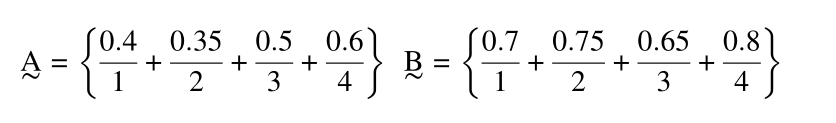

# Solving Ch (1) and Ch (2) Problems (With Python)
Ahmed Al-Qassas [qassas.ahmed@mau.edu.eg](qassas.ahmed@mau.edu.eg)  
Spring 2023-24
---
## Chapter 1 Problems
### Problem 2.1
Given two sets A̰ and B̰ shown below, find
1. A̰ ∩ B̰
2. A̰ ∪ B̰
3. A̅, B̅
4. A - B  


###### 1.  A̰ ∩ B̰
First we need to encode these two fuzzy sets using `numpy`. Then we will use `skfuzzy` to calculate the **intersection**. In, `skfuzzy` the function `fuzzy_and` is used to find the intersection.

```python
import numpy as np
import skfuzzy as fuzz

items = np.array({1, 2, 3, 4})

mu_a = np.array([0.4, 0.35, 0.5, 0.6])
mu_b = np.array([0.7, 0.75, 0.65, 0.8])
a_intersect_b = fuzz.fuzzy_and(items, mu_a, items, mu_b)
print(a_intersect_b[1]) # output: [0.4 0.35 0.5 0.6])
```

###### 2. A̰ ∪ B̰
Same goes on **union** operation. We just change the function name to `fuzzy_or`.
```python
import numpy as np
import skfuzzy as fuzz

items = np.array({1, 2, 3, 4})

mu_a = np.array([0.4, 0.35, 0.5, 0.6])
mu_b = np.array([0.7, 0.75, 0.65, 0.8])
a_union_b = fuzz.fuzzy_or(items, mu_a, items, mu_b)

print(a_union_b[1]) # output: array([0.7, 0.75, 0.65, 0.8])
```
###### 3. A̅, B̅
Complement is a unary operation. To find it, use `fuzzy_not`.  
```python
import numpy as np
import skfuzzy as fuzz

items = np.array({1, 2, 3, 4})

mu_a = np.array([0.4, 0.35, 0.5, 0.6])
mu_a_complement = fuzz.fuzzy_not(mu_a)
print(mu_a_complement) # output: array([0.6, 0.65,0.5, 0.4]

mu_b = np.array([0.7, 0.75, 0.65, 0.8])
mu_b_complement = fuzz.fuzzy_not(mu_b)
print(mu_b_complement) # output: array([0.3, 0.25, 0.35, 0.2])
```

###### 4. A - B
We know that `A - B` is `A ∩ B̅`. Let's find it.
```python
import numpy as np
import skfuzzy as fuzz

items = np.array({1, 2, 3, 4})

mu_a = np.array([0.4, 0.35, 0.5, 0.6])


mu_b = np.array([0.7, 0.75, 0.65, 0.8])
mu_b_complement = fuzz.fuzzy_not(mu_b)

a_diff_b = fuzz.fuzzy_and(items, mu_a, items, mu_b_complement)
print(a_diff_b) # output: array([0.3, 0.25, 0.35, 0.2])
```

### 2. Problem 2.3
Solved with python [here](problem-2-3.py)

#Thank You