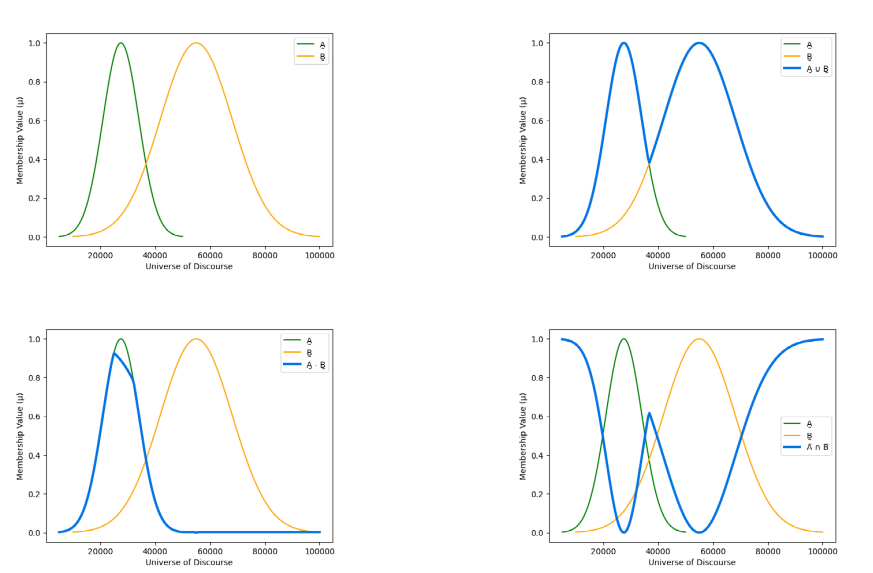

# Guide to Ch (2) and Ch (3) Problems (With Python)
Ahmed Al-Qassas [qassas.ahmed@mau.edu.eg](qassas.ahmed@mau.edu.eg)  
Spring 2023-24
---
## Chapter 2 Problems
### Problem 2.1
Given two sets A̰ and B̰ shown below, find
1. A̰ ∩ B̰
2. A̰ ∪ B̰
3. A̅, B̅
4. A - B  


###### 1.  A̰ ∩ B̰
First we need to encode these two fuzzy sets using `numpy`. Then we will use `skfuzzy` to calculate the **intersection**. In, `skfuzzy` the function `fuzzy_and` is used to find the intersection.

```python
import numpy as np
import skfuzzy as fuzz

items = np.array({1, 2, 3, 4})

mu_a = np.array([0.4, 0.35, 0.5, 0.6])
mu_b = np.array([0.7, 0.75, 0.65, 0.8])
a_intersect_b = fuzz.fuzzy_and(items, mu_a, items, mu_b)
print(a_intersect_b[1]) # output: [0.4, 0.35, 0.5, 0.6])
```

###### 2. A̰ ∪ B̰
Same goes on **union** operation. We just change the function name to `fuzzy_or`.
```python
import numpy as np
import skfuzzy as fuzz

items = np.array({1, 2, 3, 4})

mu_a = np.array([0.4, 0.35, 0.5, 0.6])
mu_b = np.array([0.7, 0.75, 0.65, 0.8])
a_union_b = fuzz.fuzzy_or(items, mu_a, items, mu_b)

print(a_union_b[1]) # output: array([0.7, 0.75, 0.65, 0.8])
```
###### 3. A̅, B̅
Complement is a unary operation. To find it, use `fuzzy_not`.  
```python
import numpy as np
import skfuzzy as fuzz

items = np.array({1, 2, 3, 4})

mu_a = np.array([0.4, 0.35, 0.5, 0.6])
mu_a_complement = fuzz.fuzzy_not(mu_a)
print(mu_a_complement) # output: array([0.6, 0.65,0.5, 0.4]

mu_b = np.array([0.7, 0.75, 0.65, 0.8])
mu_b_complement = fuzz.fuzzy_not(mu_b)
print(mu_b_complement) # output: array([0.3, 0.25, 0.35, 0.2])
```

###### 4. A - B
We know that `A - B` is `A ∩ B̅`. Let's find it.
```python
import numpy as np
import skfuzzy as fuzz

items = np.array({1, 2, 3, 4})

mu_a = np.array([0.4, 0.35, 0.5, 0.6])

mu_b = np.array([0.7, 0.75, 0.65, 0.8])
mu_b_complement = fuzz.fuzzy_not(mu_b)

a_diff_b = fuzz.fuzzy_and(items, mu_a, items, mu_b_complement)
print(a_diff_b) # output: array([0.3, 0.25, 0.35, 0.2])
```

### 2. Problem 2.3
Solved with Python and matplotlip [here](problem-2-3.py)  


## Chapter 3 Problems
### Problem 3.1
In the problem described below, our goal is to find P ⨯ T. To solve it we can use `fuzz.cartprod()`. We know how to encode our fuzzy sets an items and mu(s). Below is the solution.  

```python
import skfuzzy as fuzz
import numpy as np

items_p = np.array(['x1', 'x2', 'x3', 'x4'])
mu_p = np.array([0.4, 0.3, 0.5, 0.6])

items_t = np.array(['y1', 'y2', 'y3'])
mu_t= np.array([0.6, 0.5, 0.4])

cart_prod = fuzz.cartprod(mu_p, mu_t)
print(cart_prod) 
#output: 
# [[0.4 0.4 0.4]
#  [0.3 0.3 0.3]
#  [0.5 0.5 0.4]
#  [0.6 0.5 0.4]]
```
### Problem 3.8 

#### step 1: Encode the relations

```python
import skfuzzy as fuzz
import numpy as np

mu_r = np.array([[1, 0.3, 0.1, 0],
                 [0.2, 1, 0.3, 0.1],
                 [0, 0.7, 1, 0.2],
                 [0, 0.1, 0.4, 1]])

mu_s = np.array([[1, 0.4],
                 [0.5, 1],
                 [0.3, 0.1],
                 [0, 0]])

max_min_comp = fuzz.maxmin_composition(mu_r.T, mu_s)
max_prod_comp = fuzz.maxprod_composition(mu_r.T, mu_s)
print(max_min_comp)
# output
# [[1.  0.4]
#  [0.5 1. ]
#  [0.3 0.3]
#  [0.2 0.1]]
print(max_prod_comp)
# [[1.   0.4 ]
#  [0.5  1.  ]
#  [0.3  0.3 ]
#  [0.06 0.1 ]]

```

# Thank You